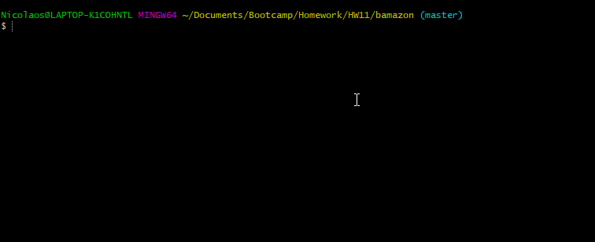
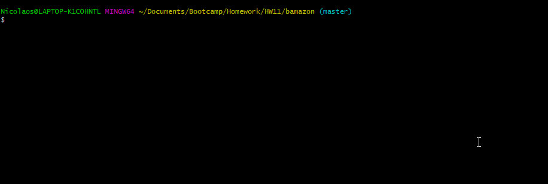

# bamazon
### Concept
Bamazon is a command line application with two different user applications: a customer, and a manager.

bamazonCustomer.js allows you to browse the Bamazon inventory, select a product and number of units to purchase, and get a total cost for the order.

bamazonManager.js allows you to browse the Bamazon inventory, search for items with low inventories, add units to specific inventories, and to add new products to the database.

### Setup
After cloning this folder to your computer, run the commands "npm init", "npm install mysql", and "npm install inquirer" to install all the dependancies required to run this app.

### Usage - bamazonCustomer:

Use the following commands to make a request:

1) Using the customer application enter the ID number of an item, and tell the program how many you intend to buy.  You will be presented with a total for that single purchase, and will be asked if you want to continue shopping.

2) For the manager application, select an action for the list.  You can inspect the inventory, check for low stock, add stock, and add new items to the database.

